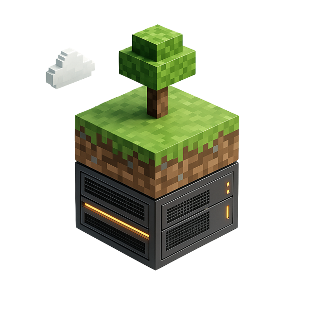
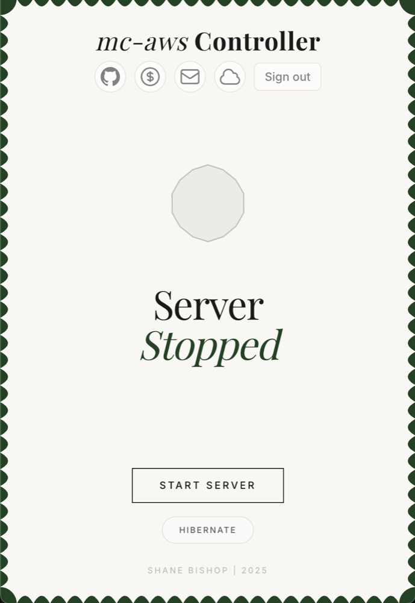
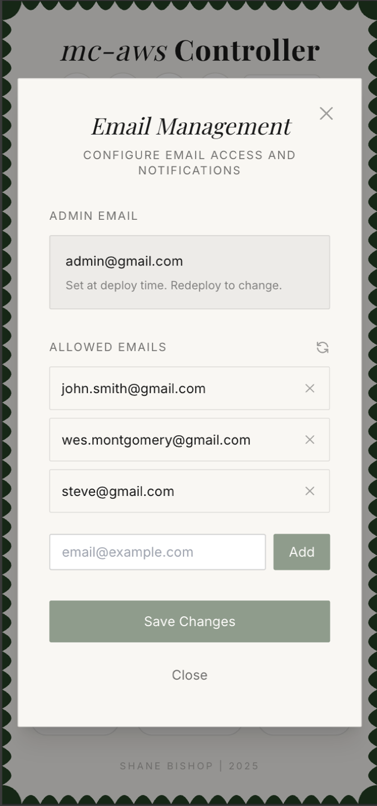
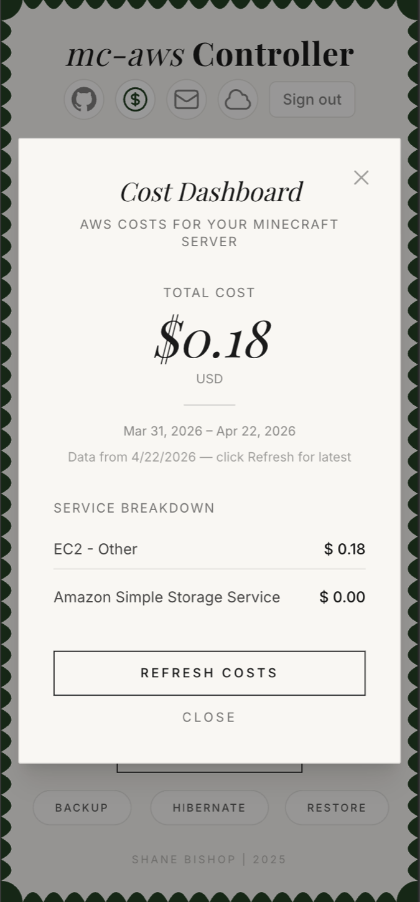
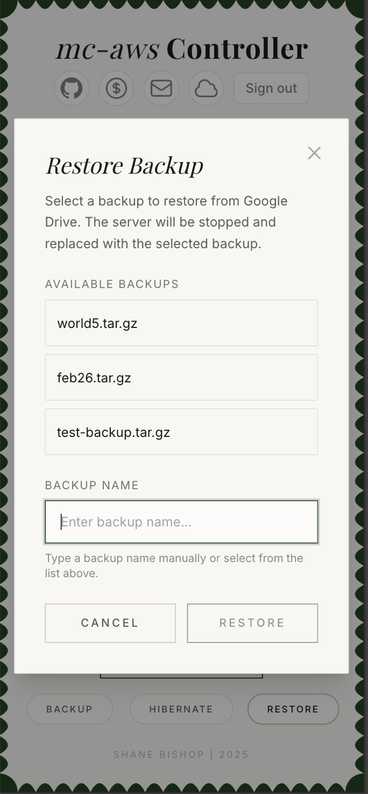

# On-Demand Minecraft Server on AWS

  
  
  

  <a href="docs/setup/SETUP_AND_RUN.md">Setup Guide</a> &middot;
  <a href="docs/README.md">Documentation</a> &middot;
  <a href="docs/OPERATIONS_GUIDE.md">Operations</a> &middot;
  <a href="https://github.com/shanebishop1/mc-aws/releases">Releases</a>

Run a Minecraft server on AWS without paying to leave it running all the time. Friends can sign in, check its status, and start it when they want to play.

## Features

<table align="center">
<tr>
  <td>
    
     
    
Monitor

  </td>
  <td>
    
     
    
Manage

  </td>
  <td>
    
     
    
Budget

  </td>
  <td>
    
     
    
Backup

  </td>
</tr>
</table>

- Web panel for start, stop, resume, and hibernate
- Google sign-in with admin and allowed-user roles
- Cloudflare, DuckDNS, or raw-IP Minecraft connections
- Google Drive backup and restore
- Optional unattended backups with freshness and failure alarms
- Optional SES notifications and authenticated email commands

## Why?

Most Minecraft hosting is priced like you are going to use the server all month. If you only play occasionally, that means paying for a box that sits idle most of the time.

Self-hosting at home avoids the monthly bill, but it creates a different problem: if your friends want to play, you either leave the server running all the time or you have to be around to start it.

This project is the middle path. The server runs on AWS, friends can start it from the control panel, and the instance can shut down when nobody is playing.

| State | What you pay for | Rough server cost |
| --- | --- | --- |
| Hibernated | No EC2 compute or attached root volume | `$0.00/month` for server compute and attached storage |
| Stopped | The EBS root volume remains attached | about `$0.75/month` for the default 8 GB volume |
| Running | EC2 compute while people play | about `$0.03-0.04/hour` for the default instance |

These are rough examples, not quotes. Backups, snapshots, data transfer, logs, requests, optional services, taxes, and provider pricing can add cost. The production alarms and 30-day log retention are enabled even when scheduled backups are disabled; at low volume, CloudWatch is commonly the largest addition at roughly `$1–3/month`. Scheduled backups add EventBridge, Lambda, SSM, Drive traffic, logs, and custom backup metrics when enabled. Region, usage, free tier, and current provider pricing determine the actual amount.

On-demand hosting providers can be a better fit if you want less setup. The reason to use this project is not just small idle-cost savings. The reason is control.

You own the infrastructure. You can change the instance size, add plugins, replace the backup flow, build a Discord or web portal, add scheduled behavior, use more AWS services, or extend the CDK stack however you want.

That matters even more now that AI can handle a lot of the glue work. You can ask an agent to add an admin route, change a deployment workflow, build a plugin process, or create a custom automation without waiting for a hosting provider to expose that feature.

You are not at the whim of a provider's dashboard, pricing model, plugin support, or roadmap. It is your server and your hosting platform.

## Production setup

Use [Setup and Run](docs/setup/SETUP_AND_RUN.md). It is the complete production procedure and covers both required `setup.sh` passes.

## Hosting choices

Cloudflare Workers hosts the panel and is mandatory. Choose either:

- the account's `workers.dev` hostname; no custom domain is needed
- a custom Cloudflare hostname

Choose the Minecraft address separately:

- Cloudflare DNS on a custom domain
- a DuckDNS hostname
- the current public IP shown in the panel

Setup prints the exact panel origin and Google sign-in/Drive callback URLs. Copy those values into the Google OAuth client, including for `workers.dev`; do not construct the URLs yourself.

## Operation and cost

Use the web panel for production changes. The server automatically stops after about 15 minutes of consecutive successful zero-player checks. A stopped instance no longer incurs EC2 compute charges, but its EBS volume still costs money.

The first deployment starts EC2 and Minecraft immediately, so billing starts during deployment. After deployment, wait for the instance and Minecraft readiness checks before connecting players or testing backups.

Hibernate backs up the server and removes its root volume. Configure Drive and test backup and restore first. On resume, choose `latest`, a named backup, or `fresh` for a new server; omitting the choice also starts fresh.

Costs vary by region, instance type, storage, snapshots, data transfer, API usage, optional services, free-tier eligibility, and provider pricing. Review the deployment preflight and monitor AWS Billing after deployment.

## Access

- `ADMIN_EMAIL` has administrative panel access.
- `ALLOWED_EMAILS` seeds the initial list of users who can start the server.
- Other signed-in users receive public/read-only access.
- SSH ingress is blocked by default. Use AWS Systems Manager Session Manager for shell access.

## Development

For local development without AWS, use [Mock Mode Quick Start](docs/QUICK_START_MOCK_MODE.md). Do not run production setup merely to install development tools.

## Documentation

- [Setup and Run](docs/setup/SETUP_AND_RUN.md)
- [Documentation index](docs/README.md)
- [Operations Guide](docs/OPERATIONS_GUIDE.md)
- [Server Profiles](docs/SERVER_PROFILES.md)
- [Teardown](docs/TEARDOWN.md)
